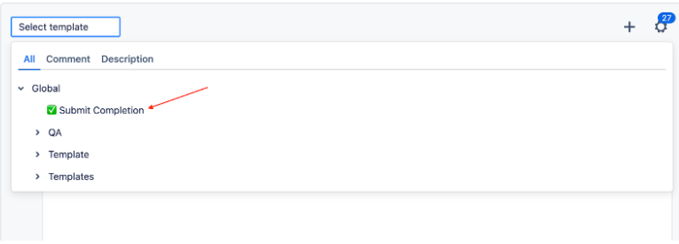
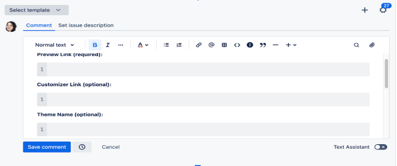

# ✅ Jira Ticket Completion

## 🔗 Go to the Assigned Ticket

Navigate to the Jira ticket assigned to you.  
Typically, this will be linked directly from your task or sprint board.

---

## 💬 Write a Comment

Scroll down to the comments section.  
When you click the text area, a dropdown with canned comment templates will appear.  
Open it and select **"✅ Submit Completion"**.

> ⚠️ **Important:** To see the template dropdown, you must have the  
> [Jira Canned Responses Web Extension installed](https://chromewebstore.google.com/detail/canned-responses-pro-for/abiklfpogpkkcelofcplnokkehjgmchc?hl=en-US&utm_source=ext_sidebar)

---

## 📝 Fill in the Required Fields

Complete all relevant fields in the "Submit Completion" template.

---

## 🚀 Final Step

Submit the comment, send the ticket for code review, and assign it to a reviewer.
