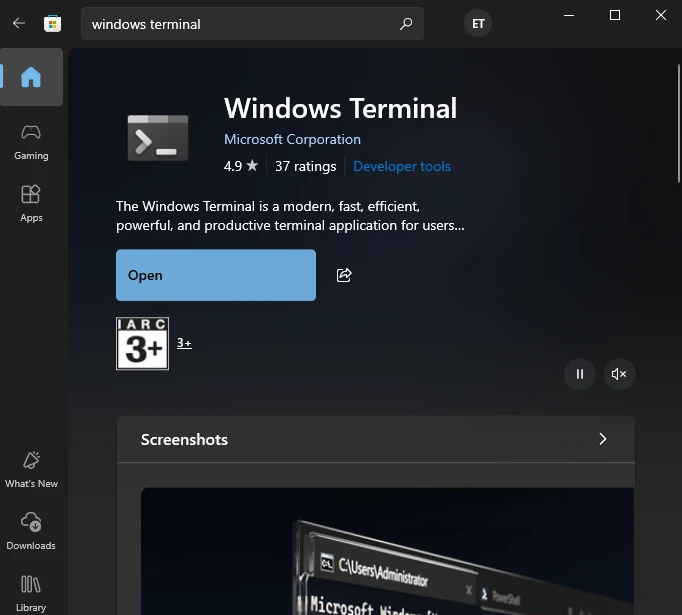

# Linux

## Installation Guide

[For Windows 10](https://www.youtube.com/watch?v=2_Ui14XtLwg)   
[For Windows 11](https://www.youtube.com/watch?v=J8cy6MDkacI)

✅ **Tip For Windows 10 users:**
> Get Windows Terminal from the Microsoft Store for a better-looking terminal. 

## Hotkeys

- cd dir  (enter a directory)
- cd ..   (back to previous dir)
- mkdir folder_name (create a new folder)
- touch file_name.extension (create a new file. list of [extensions](https://en.wikipedia.org/wiki/Category:Filename_extensions))
