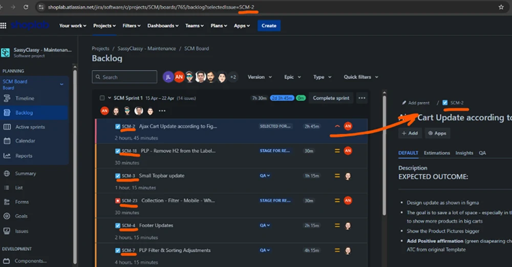
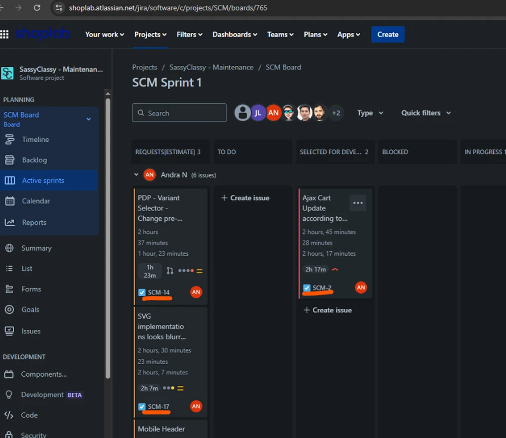
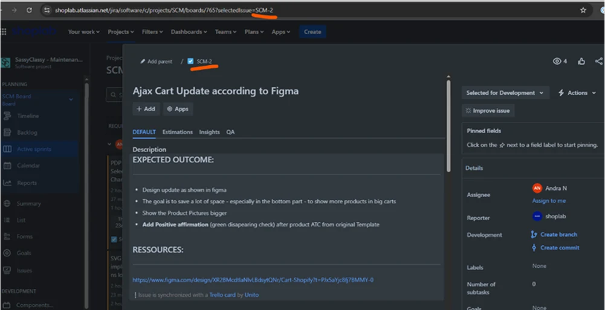

# Naming Branch Convention

## Creating New Feature

Use prefix ***feat***

## Updates or Fixing Bugs

Use prefix ***fix***

## Branch Name Format

Type + Ticket ID
e.g. ***feat/[ticket_id]*** or ***fix/[ticket_id]***

## Where to find Ticket ID

Head over to **Jira** and find a ticket that was assigned to you. samples below.

**Backlogs:**
> 

**Sprint Kanban:**
> 

**Sprint Kanban Modal:**
> 

## Creating the Branch

```bash
  # make sure you are in the master branch

  # features
  git checkout -b feat/scm-2

  # fix or updates
  git checkout -b fix/scm-2
```
