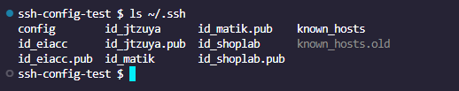

# 🔐 SSH Configuration

Set up SSH key access between your local machine and GitHub.

---

## 🧠 Managing Multiple SSH Keys

If you're using more than one SSH key (e.g. for personal and work accounts), here's an example configuration:


### Current SSH Directory Sample

Here’s what my `.ssh` directory look like: 

---

## 🚫 Common Issue: Git Push Error

You might encounter this error when pushing to a repo with incorrect SSH setup:


---

## 🛠 Commands to Set It Up

Run the following commands to add your SSH key:

```bash
eval "$(ssh-agent)"
ssh-add ~/.ssh/id_shoplab
```


## ✅ Test Your SSH Connection

To check if everything is working: 

## 🚀 Push to GitHub

Once connected, pushing should work as expected: 
